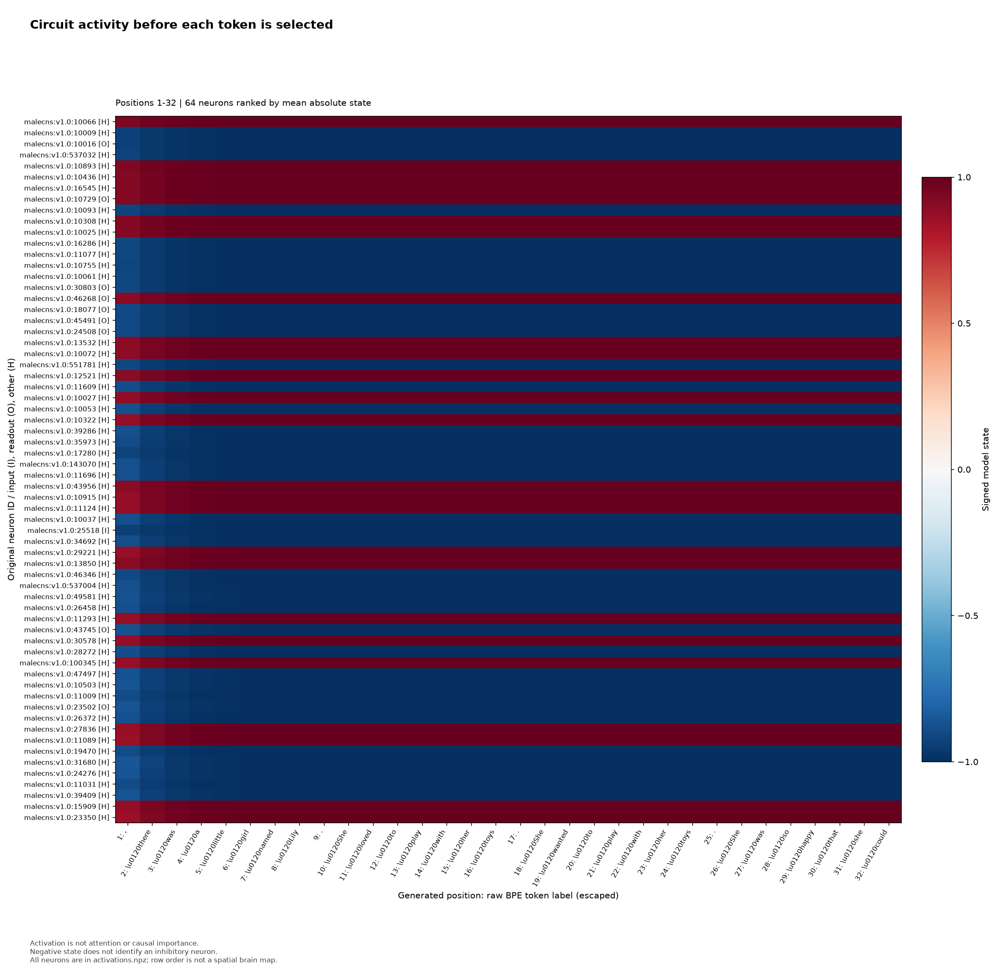
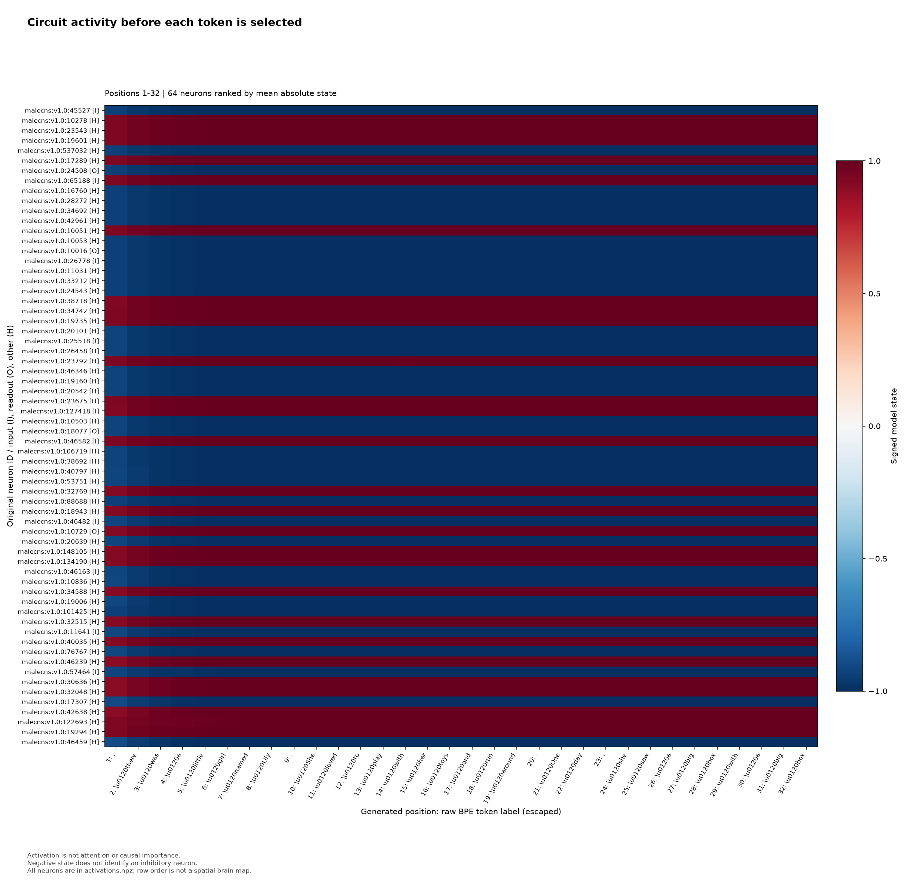

# TinyStories quality pilot

Held-out next-token prediction and local generation fluency improved from update 1000 to validation-selected update 30000, but reliable short-story generation was not demonstrated.
Test NLL fell by 1.3021 nat per BPE token and
accuracy rose from 27.29% to 41.48%. Review of every generated text found better
local sentence construction at update 30,000, alongside persistent repetition,
subject drift, broken referents, grammar errors, and causal contradictions.

This is one seed on a custom fixed corpus. It has no human ratings and no
random-topology, architecture-control, or other control comparison. The run
isn't evidence that anatomical wiring is better for language, and it makes no
claim that a fly understands language.

## Fixed protocol and scope

The prospective [protocol](QUALITY_PILOT_PROTOCOL.md) and machine-readable
[configuration](QUALITY_PILOT.json) fixed the run before GPU allocation.

- Source: `roneneldan/TinyStories`, revision
  `f54c09fd23315a6f9c86f9dc80f725de7d8f9c64`. Bounded prefixes contained
  51,000 complete official-training stories and 800 complete
  official-validation stories. After exact normalized-text deduplication, the
  first 50,000 unique training stories formed train. The first 256 remaining
  unique official-validation stories formed validation, and the next 512
  formed the untouched test split. These bounded prefixes aren't representative
  random samples of the full dataset, and exact deduplication doesn't remove
  paraphrases.
- Corpus counts, in train, validation, test order: 50,000, 256, 512 stories and
  11,113,812, 56,927, 95,495 BPE tokens. The 4,096-token byte-level BPE was fit
  only on train with `tokenizers==0.22.2`. Stories were encoded separately, so
  no cross-story training or evaluation pair was allowed.
- Corpus file SHA256:
  `5166ba21bb1a269233932c97958951553ab1b786a876c370ca25effedef1ed42`.
  Corpus fingerprint:
  `519460b05ceceaebc5c7a99098b57dee49272fdb4715bbfa62d4f3c8ecc7d776`.
- Graph: 16,384 scalar recurrent states and 1,187,999 original directed edges,
  with every original edge endpoint retained. Graph SHA256:
  `b8e259a16c8cc8936c78cb906cf64bd816af81c22de5318029e3ba8d249e53c8`.
  Graph fingerprint:
  `7749587d400d0338a6f94916d0f034494ca237e0b6a19d2a000346053dfff647`.
- Model interface: 192 learned sensory-code ports and 256 disjoint linear
  readout ports. The recurrent edge weights, sensory codes, neuron biases, and
  readout were trained. There was no Transformer, GRU, attention, pretrained
  model, distillation, or external RNN or attention module.
- Training used seed 0, float32 on one Tesla T4, context 128, batch 8, leak .5,
  initial gain .9, AdamW with betas .9 and .999, epsilon `1e-8`, no weight
  decay, and gradient clipping at 1. The fixed cosine schedule ran for 30,000
  updates after a 500-update warmup, totaling 30,720,000 sampled next-token
  targets. There was no held-out-driven budget change or early stop.
- Evaluation retained state within each story and reset it between stories.
  Every within-story next-token pair was scored once. First tokens and
  cross-story transitions were excluded.
- Context-128 training had 4,753,113 legal within-story windows. Stories too
  short to supply one full window accounted for 270,706 of 11,063,812
  within-story target pairs, or 2.4468%; those pairs remained in full-split
  evaluation but weren't eligible as training-window endpoints.

This was one real-connectome condition. No topology audit was performed, and
there was no randomized-topology or model-control comparison.

## Held-out prediction and checkpoint selection

Lower NLL and perplexity are better. Accuracy is exact next-BPE-token accuracy.
Validation used all 56,671 eligible targets at each predeclared milestone.

| Update | NLL | BPE perplexity | Correct / targets | Accuracy |
| ---: | ---: | ---: | ---: | ---: |
| 0 | 8.3178 | 4,095.94 | 4 / 56,671 | 0.0071% |
| 1,000 | 3.7716 | 43.45 | 17,503 / 56,671 | 30.8853% |
| 5,000 | 2.8831 | 17.87 | 22,956 / 56,671 | 40.5075% |
| 10,000 | 2.6816 | 14.61 | 24,308 / 56,671 | 42.8932% |
| 15,000 | 2.5821 | 13.22 | 25,178 / 56,671 | 44.4284% |
| 20,000 | 2.5028 | 12.22 | 25,759 / 56,671 | 45.4536% |
| 25,000 | 2.4546 | 11.64 | 26,121 / 56,671 | 46.0924% |
| **30,000** | **2.4346** | **11.41** | **26,311 / 56,671** | **46.4276%** |

The fixed selection rule chose the nonzero evaluated checkpoint with the lowest
validation NLL, with an exact tie going to the earlier update. It selected
update 30,000. Only then were update 1,000 and the selected/final checkpoint
evaluated on all 94,983 eligible targets in the untouched 512-story test split.

| Update | Test NLL | BPE perplexity | Correct / targets | Accuracy |
| ---: | ---: | ---: | ---: | ---: |
| 1,000 | 4.0977 | 60.20 | 25,924 / 94,983 | 27.2933% |
| **30,000** | **2.7956** | **16.37** | **39,396 / 94,983** | **41.4769%** |

The NLL gain was 1.3020767665 nat per token. The runner's machine label also
required all 30,000 updates and recovery gates, a test NLL gain of at least .50,
and no more than 3 of the 24 selected sampled continuations to contain an exact
1-to-10-word block repeated consecutively at least three times. All three gates
appeared to pass, with a recorded repeat-collapse count of 0, so local recovery
emitted `language-quality improvement demonstrated`. A later source audit found
that the launch worker used three benchmark warmups instead of the protocol's
five and that two promised visualization derivatives weren't exported. This
publication therefore doesn't present that emitted string as a fully
protocol-conformant verdict. The repetition check itself is narrow. It doesn't
measure plot continuity, referent stability, grammar, causal sense, paraphrased
loops, or shorter nonconsecutive repetition.

## Generation audit

The fixed panel generated 192 new tokens for each of eight prompts while
retaining recurrent state and feeding back generated tokens only. Update 1,000
produced one greedy and one sampled continuation per prompt, 16 texts. The
selected update produced one greedy and three sampled continuations per prompt,
32 texts. Sampling used temperature .8, nucleus probability .9, the fixed seeds,
and no top-k, repetition penalty, blocking, reranking, or replacement samples.
The full 48 texts and token IDs are in the [update 1,000 result](results/tinystories-quality-pilot/result-001000.json)
and [update 30,000 result](results/tinystories-quality-pilot/result-030000.json).

Every one of those 48 texts was reviewed. At update 1,000, all eight greedy
outputs settled into repeated sentence templates or loops. Its eight sampled
outputs avoided the same exact collapse but were mostly fragmented, changed
characters or subjects without support, confused pronouns, and often broke
syntax. At update 30,000, local clauses and dialogue were more often readable,
and several sampled openings sustained a scene for multiple sentences. That is
the observed local fluency improvement. It didn't extend to dependable stories.
All eight final greedy outputs still repeated phrases, events, or whole
patterns. Across all 24 final samples, subject drift, unstable names and
referents, malformed grammar, unexplained scene changes, contradictory actions,
and weak cause and effect remained common. Bird-prompt samples were especially
repetitive even without tripping the fixed exact-block detector.

The aggregate diagnostics agree that the change wasn't uniformly better:

| Update and mode | Texts | Mean unique-word ratio | Mean repeated-4-gram fraction |
| --- | ---: | ---: | ---: |
| 1,000 greedy | 8 | 17.03% | 68.00% |
| 1,000 sampled | 8 | 54.82% | 0.33% |
| 30,000 greedy | 8 | 25.33% | 47.92% |
| 30,000 sampled | 24 | 48.32% | 2.73% |

These exact excerpts are representative slices, not claims that the outputs form
sound stories. Failures are shown rather than edited out.

**Update 1,000, prompt 0, greedy, eventual loop:**

> The little girl was so excited that he could find it was so much fun!
> The little girl was so excited that he could find it was so much fun!

**Update 30,000, prompt 0, sampled draw 1, locally readable but with broken
reference and event logic:**

> One day, they saw a big boy playing in the park. He wanted to climb the tree,
> but he couldn't find it. He was alone and he couldn't find anyone to play.

**Update 30,000, prompt 2, sampled draw 0, causal and grammatical defect:**

> He grabbed a stick and flew down to get it back. He landed on the ground and
> picked it up.

**Update 30,000, prompt 6, greedy, clear collapse:**

> I am a friendly cat. I am a cat. I am a cat. I am a cat. I am a cat.

The conservative verdict is therefore: held-out prediction improved; reliable
short-story generation was not demonstrated.

## Token-linked model state

The four recordings cover greedy generation for prompt 0, `Once upon a time`,
and prompt 3, `A little rabbit lost the key to her house.`, at updates 1,000 and
30,000. Each NPZ contains the full `192 x 16,384` float32 state array, generated
token IDs, selected-token probabilities, original neuron IDs, and the 64
magnitude-ranked display indices. Mean step change is the mean adjacent-step L2
state difference normalized by the square root of 16,384.

| Update | Prompt | Mean absolute state | Mean step change | Mean selected-token probability | Display cells with `|state| >= .99` | Full array with `|state| >= .99` |
| ---: | ---: | ---: | ---: | ---: | ---: | ---: |
| 1,000 | 0 | 0.385382 | 0.113876 | 0.265171 | 97.974% | 5.43% |
| 1,000 | 3 | 0.387395 | 0.115862 | 0.317923 | 100% | 5.42% |
| 30,000 | 0 | 0.563030 | 0.308618 | 0.497185 | 98.226% | 11.19% |
| 30,000 | 3 | 0.558861 | 0.312967 | 0.448670 | 100% | 11.06% |

The displayed selected-cell saturation fractions above are in directory order:
`activations-001000/prompt-00`, `activations-001000/prompt-03`,
`activations-030000/prompt-00`, and `activations-030000/prompt-03`. They are
selection effects from ranking 64 of 16,384 states by mean absolute magnitude,
not whole-array rates. None of the 64 displayed rows changes sign in any
recording. Cross-update overlap is only 13 of 64 selected IDs for prompt 0 and
15 of 64 for prompt 3, with zero shared IDs occupying the same row slot.
Rankings are recomputed independently, so rows cannot be visually compared
across recordings. Prompt 0 shared its first 16 generated tokens across updates;
prompt 3 shared only its first 2.

The activity is computational model state before token selection, conditioned on
prior token history. It isn't attention, firing, inhibition, causal importance,
localization, or biological function. The recordings don't show increased token
sensitivity or recruited language neurons. This report makes no biological
evidence claim.

## Activation pages



*Update 1,000, prompt 0, page 1 of 6, positions 1 to 32. States are recorded
before selecting the labeled token, conditioned on prior token history.*



*Update 30,000, prompt 0, page 1 of 6, positions 1 to 32. States are recorded
before selecting the labeled token, conditioned on prior token history.*

All 24 PNG pages and all four raw arrays and metadata files are linked below.
Each page covers 32 successive generated positions on the fixed `[-1, 1]`
color scale.

| Recording | PNG pages | Full array | Metadata |
| --- | --- | --- | --- |
| Update 1,000, prompt 0 | [1](results/tinystories-quality-pilot/activations-001000/prompt-00/activations-001.png), [2](results/tinystories-quality-pilot/activations-001000/prompt-00/activations-002.png), [3](results/tinystories-quality-pilot/activations-001000/prompt-00/activations-003.png), [4](results/tinystories-quality-pilot/activations-001000/prompt-00/activations-004.png), [5](results/tinystories-quality-pilot/activations-001000/prompt-00/activations-005.png), [6](results/tinystories-quality-pilot/activations-001000/prompt-00/activations-006.png) | [NPZ](results/tinystories-quality-pilot/activations-001000/prompt-00/activations.npz) | [JSON](results/tinystories-quality-pilot/activations-001000/prompt-00/activations.json) |
| Update 1,000, prompt 3 | [1](results/tinystories-quality-pilot/activations-001000/prompt-03/activations-001.png), [2](results/tinystories-quality-pilot/activations-001000/prompt-03/activations-002.png), [3](results/tinystories-quality-pilot/activations-001000/prompt-03/activations-003.png), [4](results/tinystories-quality-pilot/activations-001000/prompt-03/activations-004.png), [5](results/tinystories-quality-pilot/activations-001000/prompt-03/activations-005.png), [6](results/tinystories-quality-pilot/activations-001000/prompt-03/activations-006.png) | [NPZ](results/tinystories-quality-pilot/activations-001000/prompt-03/activations.npz) | [JSON](results/tinystories-quality-pilot/activations-001000/prompt-03/activations.json) |
| Update 30,000, prompt 0 | [1](results/tinystories-quality-pilot/activations-030000/prompt-00/activations-001.png), [2](results/tinystories-quality-pilot/activations-030000/prompt-00/activations-002.png), [3](results/tinystories-quality-pilot/activations-030000/prompt-00/activations-003.png), [4](results/tinystories-quality-pilot/activations-030000/prompt-00/activations-004.png), [5](results/tinystories-quality-pilot/activations-030000/prompt-00/activations-005.png), [6](results/tinystories-quality-pilot/activations-030000/prompt-00/activations-006.png) | [NPZ](results/tinystories-quality-pilot/activations-030000/prompt-00/activations.npz) | [JSON](results/tinystories-quality-pilot/activations-030000/prompt-00/activations.json) |
| Update 30,000, prompt 3 | [1](results/tinystories-quality-pilot/activations-030000/prompt-03/activations-001.png), [2](results/tinystories-quality-pilot/activations-030000/prompt-03/activations-002.png), [3](results/tinystories-quality-pilot/activations-030000/prompt-03/activations-003.png), [4](results/tinystories-quality-pilot/activations-030000/prompt-03/activations-004.png), [5](results/tinystories-quality-pilot/activations-030000/prompt-03/activations-005.png), [6](results/tinystories-quality-pilot/activations-030000/prompt-03/activations-006.png) | [NPZ](results/tinystories-quality-pilot/activations-030000/prompt-03/activations.npz) | [JSON](results/tinystories-quality-pilot/activations-030000/prompt-03/activations.json) |

## Runtime, recovery, and provenance

- The run used one Tesla T4 with Python 3.13.15, Torch 2.11.0+cu128, and CUDA
  12.8. Total runtime was 5,657.10369994 seconds, about 1 hour 34 minutes 17
  seconds. Peak allocated CUDA tensors were 478,788,096 bytes. This excludes
  the CUDA context, allocator reservation, and other process or driver memory.
- The preflight benchmark measured 20 updates after three warmups at
  0.17509210745 second per update. It projected 7,465.954029 seconds and used a
  peak 395,033,088 allocated bytes, below both launch limits. The protocol
  required five warmups. This two-warmup launch-script deviation was discovered
  after recovery; the completed training budget and measured model outputs are
  retained, but full procedural conformance isn't claimed.
- Same-runtime checkpoint restore passed, and stored generations reproduced on
  the T4. This establishes restore and generation reproduction for the saved
  run, not bitwise equality of additional resumed CUDA updates. Such checkpoint
  continuation wasn't tested.
- The downloaded ZIP passed CRC and semantic checks. Local strict recovery
  independently checked protocol, graph, corpus, checkpoints, Adam moments,
  window RNG, learning-rate position, metrics, generation records, activation
  arrays, neuron IDs, contexts, and figures. See the [recovery report](results/tinystories-quality-pilot/recovery.json)
  and recovered [verification](results/tinystories-quality-pilot/verification.json),
  [benchmark](results/tinystories-quality-pilot/benchmark.json), and
  [seal](results/tinystories-quality-pilot/seal.json).
- After the original session became orphaned, the exact existing assignment was
  retrieved in read-only mode. No new accelerator was allocated for retrieval.
  The downloaded archive hash was checked before use. The exact T4 assignment
  was then released, and the authenticated session listing reported no active
  sessions.

Source commit:
`3d41f9eb26511a47f80952a4d6229d2dc8d8cb82`.

Key identities:

- semantic protocol SHA256:
  `08a49406e82dd51950bc3646940ee6f80e99a43e04f43372223e33f729084539`
- `QUALITY_PILOT.json` file SHA256:
  `110ea027617127781de78352eb6cc776913f9f8ee68c41dd8bf44c40f18f889b`
- frozen source bundle SHA256:
  `9ab96d8d0e0cbe79efe275ac7f16fff12c299e636d23653bbed7aeb4fab5bcb8`
- input bundle SHA256:
  `f0d86f9243b0c30db39634557f53ea9d7e565493745934315d5faeb5f841be39`
- update 1,000 checkpoint SHA256:
  `95bc3d42fb89c33cc30d4970afe06d85c4492733d75d21c858878db1a2ff58e8`
- final/latest checkpoint SHA256:
  `0b8c45756ad883142c4a5b270739711585cddd1ebff2fafbbf52de8100913736`
- recovered result ZIP SHA256:
  `56c61f9963cc6a290eb78944fedde7dfaefc92d198858e5036077087fbbb0525`

The protocol also requested temporal-variation-ranked heatmaps and a
fixed-camera anatomical playback. The runner exported the four complete raw
state arrays and 24 magnitude-ranked pages, but not those two derivatives.
They weren't reconstructed after the fact. This is a visualization-deliverable
deviation, not missing training, likelihood, generation, or state-array data.

The concise machine summary is [QUALITY_PILOT_RESULTS.json](QUALITY_PILOT_RESULTS.json).

## Reproduction and publication boundary

On an actual Tesla T4, from a fresh checkout with the prepared graph and corpus
at their fixed paths, reproduce the fixed run into a new destination:

```bash
uv run python -m scripts.run_quality_pilot \
  --protocol QUALITY_PILOT.json \
  --output results/tinystories-quality-pilot-reproduction \
  --recovery-gates-complete
```

Strictly recover and verify the retained archive into another new destination:

```bash
uv run python -m scripts.recover_quality_pilot \
  --archive artifacts/quality-pilot-recovered/quality-pilot-results.zip \
  --protocol QUALITY_PILOT.json \
  --destination results/tinystories-quality-pilot-recovery-check
```

Both commands fail closed if the output destination already exists. The run
command also rejects CPU fallback and non-T4 CUDA devices. The full checkpoint
archive remains local. Publication includes this report, the machine evidence,
the two complete result JSON files, and the activation PNG, JSON, and NPZ
artifacts.

No human ratings were collected. With one seed, a custom fixed corpus, bounded
source prefixes, no topology audit, and no topology or architecture control,
the evidence supports improved held-out prediction and local generation
fluency only. It doesn't support reliable short-story generation, language
understanding, a biological mechanism, or any claim that a fly understands
language.
