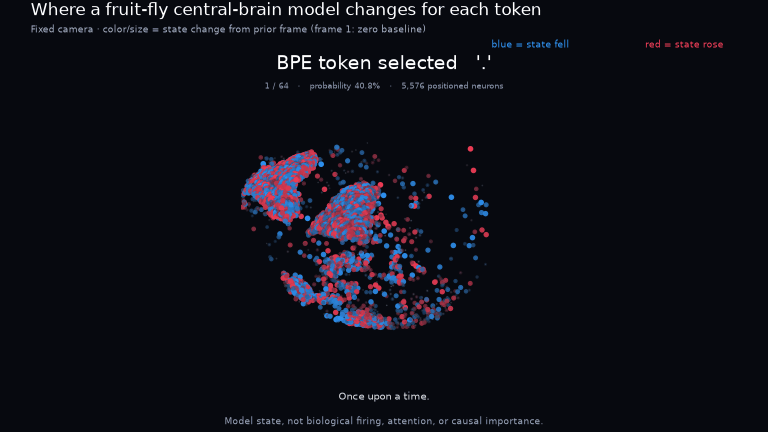

# FLY AS A LANGUAGE MODEL

A language-model experiment built on a real fruit-fly connectome. Text stimulates
sensory neurons; activity propagates through anatomical connections; a linear
readout predicts the next token. Backpropagation changes the weights on those
connections, without replacing the recurrent core with a transformer.

**WikiText BPE status: prediction learned, but ordinary models performed better and
trained faster. The study is stopped with 6 of 15 planned runs complete.**
One full five-model comparison and one additional anatomical run finished;
the next run was interrupted. Fluent language and a biological-wiring advantage
were not demonstrated. The anatomical runs reported here used a 16,384-neuron
subset, not the full retained graph.

Inspired by [DOOMFLY](https://github.com/nftechie/doomfly), this independent
experiment takes the connectome-to-computation question from game control to
text prediction.

## Latest result: bAbI Task 1

The fixed [bAbI Task 1 benchmark](BABI_TASK1_RESULTS.md) trained the real
16,384-neuron connectome recurrent core to answer single-supporting-fact
location questions, without an external RNN or attention module. The selected
one-seed checkpoint answered **602/1,000 official test questions exactly
(60.2%)**. This is weak partial task learning, not the conventional 95% solved
threshold.

When all preceding facts about the queried person were removed without
retraining, accuracy fell to **157/1,000 (15.7%)**. The frozen evidence-use
sanity check passed, supporting sensitivity to the supplied location evidence.
It is not a topology comparison or proof of general reasoning, biological
function, or language understanding. All 2,000 ordinary and ablated predictions,
source/license provenance, checkpoint selection, restoration evidence and
strict local recovery records are published with the report. No bAbI Task 2
experiment was run. Periodic recovery copies remained on the same Colab VM, so
the completed result recovered successfully but the run does not claim full
operational protocol conformance.

## Previous result: quality-first TinyStories run

The [quality-first TinyStories experiment](QUALITY_PILOT_RESULTS.md) kept the
real 16,384-neuron MaleCNS connectome as the recurrent core and added no
external RNN or attention module. One seed trained for the frozen 30,000-update
budget on a Colab Free Tesla T4. Validation selected the final checkpoint:
held-out test perplexity fell from **60.20 at update 1,000 to 16.37 at update
30,000**, while next-token accuracy rose from **27.29% to 41.48%**.

Inspection of all 48 fixed generation-panel outputs found better local fluency
and occasional stronger prompt continuity, but also persistent greedy loops,
sampled topic drift, unstable referents and weak narrative development.
Reliable short-story generation was **not** demonstrated. The experiment made
no topology comparison and does not establish a biological language mechanism.

All eight validation milestones, both test evaluations, generation records and
four full 192-by-16,384 token-aligned state recordings passed strict recovery.
The activity plots report signed model states before token selection; they are
not attention, firing rates, biological localization or causal importance.

## Earlier TinyStories anatomy studies

[The TinyStories pilot](PILOT.md) adds story-isolated next-token training with
learnable sensory codes and token-aligned neuron activation heatmaps. It keeps
the anatomical circuit as the model core, without an attention or GRU layer.
The first 16,384-neuron T4 pilot completed 1,000 updates: held-out test perplexity
fell from 4,096.25 to **57.99**, with **28.29%** next-token accuracy. Generated
text has recognizable sentence fragments but still contains errors and repetition.
[Results, full continuations and activation observations](TINYSTORIES_RESULTS.md)
describe the small custom split and limitations. The historical BPE study below
remains stopped.

The [GPU optimization](GPU_OPTIMIZATION.md) subsequently reduced same-T4 training
time from 0.397 to 0.128 seconds/update (**3.11x**) through fused edge gradients
and a batched sequence readout. A second same-T4 comparison reduced the selected
implementation from 0.116 to 0.079 seconds/update (**1.46x**) by preparing sparse
values once per sequence and replacing native SpMM with cached-layout Triton CSR.
It did not change the anatomical topology or establish a new language-quality
score.

The [central-brain follow-up](CENTRAL_BRAIN_RESULTS.md) then compared the
visual-biased graph with two induced `cb_intrinsic` selections and
degree-preserving shuffled controls in one six-condition T4 run. Central real
wiring beat its own shuffle at both scales: test perplexity was **88.45 versus
124.89** for the edge-matched graph and **111.66 versus 189.84** for the
node-matched graph. The visual-biased reference remained better in absolute
quality at **57.10**. This is one seed, not proof of a biological language
specialization, but it is the clearest wiring-sensitive result in the project
so far. Full activation arrays and all 12 heatmap pages were recovered and
verified.

A prespecified [six-seed replication](CENTRAL_BRAIN_REPLICATION.md) then tested
the edge-matched N5,600 central graph with fresh seeds 1–6. Original wiring beat
its degree-preserving shuffled-target control in **all six pairs**. The median
test-NLL advantage was **0.6587 nat/token**, the real/shuffled geometric-mean
perplexity ratio was **0.5314** (46.9% lower for real wiring), and the two-sided
exact probability of six concordant signs was **0.03125**. All 12 conditions
completed without resume on one Tesla T4 and passed strict checkpoint,
optimizer, RNG, activation and provenance recovery. This clears the frozen
decision gate for an anatomy-aware ALPN-to-MBON port experiment; it does not
establish superiority to a same-scale Transformer or generalization beyond the
fixed graph and custom TinyStories corpus.

The next [anatomy-aware port factorial](ANATOMY_PORT_EXPERIMENT.md) trained 36
fresh conditions over seeds 7-12. Forcing language input through all 313 ALPNs
and output through all 97 MBONs was worse than capacity-matched random ports in
every seed: the median primary NLL gain was **-.6255 nat/token**. The MBON output
effect was negative in all six seeds, with median **-.6196**. Both prespecified
advancement gates failed. This is a useful negative result: publisher anatomy
classes are not automatically good language-model ports.

A subsequent [frozen regional-probe experiment](REGIONAL_PROBE_EXPERIMENT.md)
trained 168 equal-width linear heads without changing the recurrent models.
The trained-readout positive control passed, and **ALPN was the only nominated
regional candidate**. Across the six real-wiring seeds, fixed ALPN subsets beat
degree-matched neurons by median **.1532 nat/token** and the unigram reference
by median **.4388**, with 6/6 positive signs. Its raw intersection probability
was `p = .015625`, significant after Holm correction (adjusted
`p = .046875`). Kenyon and centrality failed their matched-comparator gates,
and MBON was worse than degree-matched neurons in all six seeds. ALPN
performance did not consistently improve under real versus shuffled wiring,
so this shows linear accessibility from ALPN states, not a causal advantage
from intact ALPN connectivity.

The prospective [ALPN causal follow-up](ALPN_CAUSAL_EXPERIMENT.md) then stopped
at its predeclared common-support gate with
`insufficient_common_support`. Every structure-matched and
structure-plus-activity-matched control draw failed at least one balance bound
in all six seeds. Per protocol, the 68 fresh stories were never uploaded, no
new probe was fitted, and no intervention was scored. This is a documented
matching failure, not evidence for or against ALPN-specific causality.

### Watch the model select each token

[](BRAIN_ACTIVITY.md)

The [token-synchronized anatomical playback](BRAIN_ACTIVITY.md) places all
5,576 positioned neurons from the N5,600 recording at their measured MaleCNS
soma coordinates. Every frame corresponds to one generated token. Color shows
the direction of model-state change; brightness and point size show its
magnitude. The camera stays fixed so spatial changes are not confused with
rotation. Frame 1 uses the zero state as its baseline because no previous
recorded frame exists. The remaining 24 neurons have no measured soma coordinate
and are omitted rather than assigned invented positions. This is model activity,
not biological firing, attention or causal importance.

## Historical result: WikiText BPE comparison

A train-only **4,096-token byte-level BPE** vocabulary was fitted on the full
normalized WikiText-2 training split: 2.83 million tokens. Each neural run used
the same 2,048,000-target budget, batch 8 and context 32. The three fully
trainable architectures have approximately 2.25 million parameters.

Completed seed-0 results on **1,024 identical held-out final-target windows**:

| Model | Test perplexity (lower is better) | Test token accuracy | Training time |
| --- | ---: | ---: | ---: |
| Anatomical, trained | 187.04 | 20.31% | 25.85 min |
| Rewired, trained | 196.88 | 19.92% | 28.62 min |
| Anatomical, frozen core | 384.02 | 13.57% | 3.64 min |
| Ordinary GRU | **56.53** | **29.49%** | **0.56 min** |
| Small Transformer | 65.32 | 27.83% | 1.25 min |

The anatomical model improved from test perplexity **4,096.64 to 187.04**.
Its completed seed-1 repetition reached **172.83**, but matching controls for
that seed did not finish. There is no completed three-seed comparison or
statistical claim of wiring superiority.

These are windowed **BPE-token** metrics, not character BPC or standard
word-level WikiText perplexity. The models use different input representations:
ordinary models learn embeddings, while the anatomical model uses fixed codes.
Frozen-core training intentionally has fewer trainable parameters.
Reported times are training only, excluding evaluation and checkpoint I/O.

The T4 runtime ended during seed-1 shuffled training. Six completed checkpoints
were recovered, plus an external 4,250-update checkpoint for the interrupted run.
Further experiments and automatic retries were stopped by the user.
Free generation still contains malformed fragments, topic drift and loops:

```text
 , the <unk> of the <unk> , <unk> , <unk> , <unk> , <unk>
```

[Partial results and limitations](BPE_RESULTS.md) include all six runs, validation
scores, baselines, timings, CPU bottleneck evidence and checkpoint checks.
[Fixed protocol](BPE_STUDY.md) and [BPE implementation](BPE.md) describe reproduction.
The historical character pilot below is a separate experiment.

## The anatomical loop: original character pilot

1. A character from a **48-character alphabet** activates a fixed bipolar code
   on **192 sensory neurons**. These ports are sampled, not identified natural
   language or sensory circuits.
2. Continuous neural states propagate through **16,384 neurons and 1,187,999
   directed connections** retained from MaleCNS v1.0. Only existing anatomical
   edges carry learned recurrent weights.
3. A **256-neuron readout**, disjoint from the input ports, predicts the next
   character. Its 12,336 parameters form a small decoder, not a pretrained
   language model.
4. Teacher-forced next-character loss trains edge weights, neuron biases and
   the readout through **32-character windows**. The topology stays fixed.
5. During free generation, each predicted character becomes the next input.
   Neural state persists; no future reference text is supplied.

```text
character -> fixed sensory code -> anatomical recurrent network -> next character
                                     ^                               |
                                     +-------- feedback -------------+
```

The wiring comes from a biological reconstruction. The scalar neuron dynamics,
functional signs, input/output ports and learning rule are engineering choices.
This does not demonstrate that a living fly can learn human language.

## Historical result: character pilot

One seed, three matched conditions, 4,000 updates each on Colab Free with a
Tesla T4. Each condition sees 1,024,000 next-character training targets from a
250,000-character WikiText-2 training slice.

All models and train-fitted n-gram baselines are evaluated on the same **1,024
held-out target positions**. Lower bits per character (BPC) is better.

| Model | Test accuracy | Test BPC |
| --- | ---: | ---: |
| Unigram | 18.36% | 4.3614 |
| Bigram | 31.45% | 3.3275 |
| Trigram | 41.02% | **2.8048** |
| Anatomical, trained | **45.21%** | 2.8057 |
| Rewired, trained | **45.21%** | 2.8253 |
| Anatomical, frozen core | 28.81% | 3.6720 |

Training the anatomical model reduced its test BPC from **5.5852 to 2.8057**.
It improved accuracy over the trigram, but not BPC. Rewiring produced nearly
the same result. One initialization is not evidence of anatomical superiority.

The rewired control preserves directed degree counts, permits parallel edges
and self-loops, and retains the original edge-order initial weights. The frozen
control trains only the readout. [Full results](AR_RESULTS.md) include the
initial scores, core ablation, timings and checkpoint verification.

### What it writes

Anatomical model, sampled continuation. The actual training-only prompt is
`= valkyria chronicles iii = senj`. Output is wrapped for display:

```text
el arment some e kordungsesy the have to reage poluches nov reperateen
thas sere hed at roptrale hith relayp , semunn anced whe eimol smankay
an fhelait cormecration , surcy nergo . " h werve under hir hule wor
sernom nemy ; b1 a follen gs
```

It has learned character patterns and fragments of words, not coherent prose.
Greedy generation enters repetitive loops. The unedited outputs are in the
[anatomical model report](results/ar-main/seed-0/real/report.json).

## The scale boundary: character capacity measurements

MaleCNS v1.0 covers the brain **and ventral nerve cord**. The full retained
annotated neuronal graph has **166,700 neurons, 25,582,938 directed pairs and
124,177,617 synaptic contacts**.

| Graph | What was tested | T4 warm update | Peak allocated GPU memory |
| --- | --- | ---: | ---: |
| 16,384 neurons | Natural-text training and matched controls | 0.188 s | 0.197 GiB |
| 166,700 neurons | Synthetic forward/backward/AdamW capacity | 4.626 s | 2.591 GiB |

These short capacity measurements use batch 8 and context 32; GPU allocation
excludes driver overhead. The full graph was **not trained on natural text**.
The trained subset is an optic-lobe-biased induced hub-BFS neighborhood, not a
whole brain or a uniformly sampled miniature brain.

Cached sparse patterns avoid repeated sorting and any dense neuron-by-neuron
matrix. This brought full-graph update time down from 11.872 to 4.626 seconds.
See [anatomy and provenance](data/large_connectome/README.md) and the
[recorded capacity measurements](artifacts/ar-capacity-cached.json).

## Reproduce an experiment

The following commands are reproduction instructions, not evidence of ongoing
training. No experiment is being automatically resumed for this publication.

### Full-corpus BPE protocol

The prepared corpus, tokenizer, pilot graph and fixed plan are committed.
After installing the project as shown below, on a compatible CUDA machine:

```bash
python -m scripts.run_bpe_study --job 0
```

Jobs `0..4` select the five seed-0 conditions; `5..9` and `10..14` select the
planned repetitions. A job resumes its own existing checkpoint if present.
See [the stopped-study report](BPE_RESULTS.md) for which jobs actually completed.

### Original character pilot

Use a Colab T4 runtime with a compatible preinstalled PyTorch, or a local CUDA
machine. The pilot graph and corpus are committed; the 1.07 GB raw connectome
download is not needed for this run.

```bash
git clone https://github.com/leetae9yu/fly-as-a-lm.git
cd fly-as-a-lm
python -m pip install -e '.[language]'
bash run_ar_colab.sh --output results/ar-fresh
```

The recorded run used Python 3.13, Torch 2.11.0+cu128 and NumPy 2.5.3. Local
checks used Python 3.12. The three measured run calls took about 30 minutes
combined, excluding environment setup. Your hardware and software may differ.

For a small **CPU software smoke test**, not a reproduction of the pilot:

```bash
python -m flyrl.autoregressive \
  --graph data/large_connectome/malecns_v1_n256.npz \
  --corpus data/ar_corpus/corpus.npz \
  --output results/cpu-smoke --device cpu \
  --updates 10 --seeds 0 --controls real \
  --batch-size 2 --context 8 --eval-windows 16 --sample-length 80
```

Continue a run to a **total** update count:

```bash
bash run_ar_colab.sh --output results/ar-fresh --resume --updates 5000
```

Checkpoints are written every 200 updates. Parameters, Adam state, window RNG
and progress are restored; incompatible configurations and runtimes are
rejected. CUDA continuation can have small numerical differences. Colab VM
storage is temporary: download checkpoints before releasing a runtime.

Model weights and large raw downloads are not stored in Git. Re-running the
commands creates your own checkpoints. The committed JSON reports preserve
the original measurements. Detailed setup and verification:
[AUTOREGRESSIVE.md](AUTOREGRESSIVE.md).

## Work on this with me

The current comparison exposes a substantial performance and throughput gap.
Useful contributions would investigate that gap without turning trainability
into a claim about fly intelligence.

- **Replication:** run more seeds under the same budget and report the spread.
- **Baselines:** extend the existing GRU/Transformer comparison with controlled budgets.
- **Anatomy:** test other regions and input/output placements with matched controls.
- **Scaling:** improve sparse throughput and measure longer or larger runs.
- **Interpretability:** inspect what changes in the trained circuit, using
  interventions rather than labels inferred from attractive visualizations.

For experimental contributions, include configuration, seed, graph/corpus
hashes, train/validation/test separation, matched controls and machine-readable
results. Keep negative results. For implementation changes, include a regression
test or a reproducible numerical check.

```bash
python -m pip install pytest
python -m scripts.verify_torch -q
```

The current publication tree passes **675 local tests**, with 54 CUDA-only tests
skipped on the CPU workstation. The final regional run completed all 168 heads
on a Tesla T4 and passed strict source, trace, feature, parameter, runtime and
aggregate-decision recovery. The Torch wrapper explicitly enables sparse-check
defaults without filtering warnings. Software correctness is not biological
validity.

## Repository map

| Path | Contents |
| --- | --- |
| `flyrl/ar_*.py`, `flyrl/autoregressive.py` | Shared likelihood training, anatomical model, evaluation and checkpoints |
| `flyrl/bpe_*.py`, `data/bpe_corpus/`, [BPE.md](BPE.md) | Train-only byte BPE, prepared inputs and subword usage |
| `flyrl/gru_model.py`, `flyrl/transformer_model.py` | Ordinary parameter-matched references |
| `data/bpe_full/`, [BPE_STUDY.json](BPE_STUDY.json) | Full-training corpus and predeclared 15-job plan |
| [BPE_RESULTS.md](BPE_RESULTS.md), [BPE_STUDY.md](BPE_STUDY.md) | Partial results and methods |
| `results/bpe-main/`, `results/bpe-resume/` | Six completed reports and restoration evidence |
| `scripts/prepare_large_connectome.py` | Pinned anatomical data importer |
| `data/large_connectome/`, `data/ar_corpus/` | Prepared inputs, source records and hashes |
| `results/ar-main/`, `results/ar-resume/` | Measured results and restoration evidence |
| `tests/` | Numerical, learning, data and checkpoint checks |
| [AR_RESULTS.md](AR_RESULTS.md) | Full pilot results and limitations |
| [AUTOREGRESSIVE.md](AUTOREGRESSIVE.md) | Model definition and reproduction protocol |
| [CENTRAL_BRAIN_RESULTS.md](CENTRAL_BRAIN_RESULTS.md), [CENTRAL_BRAIN_REPLICATION.md](CENTRAL_BRAIN_REPLICATION.md) | Central-graph comparison and six-seed wiring replication |
| [ANATOMY_PORT_EXPERIMENT.md](ANATOMY_PORT_EXPERIMENT.md) | Six-seed ALPN/MBON port factorial and negative result |
| [REGIONAL_PROBE_EXPERIMENT.md](REGIONAL_PROBE_EXPERIMENT.md) | Frozen 168-head localization protocol, ALPN result and recovery limits |
| [ALPN_CAUSAL_EXPERIMENT.md](ALPN_CAUSAL_EXPERIMENT.md) | Fresh-text causal protocol and insufficient-common-support calibration result |
| [QUALITY_PILOT_PROTOCOL.md](QUALITY_PILOT_PROTOCOL.md), [QUALITY_PILOT_RESULTS.md](QUALITY_PILOT_RESULTS.md) | Frozen 30,000-update quality-first TinyStories protocol and verified result |
| `flyrl/quality_*.py`, `scripts/run_quality_pilot.py`, `scripts/recover_quality_pilot.py` | Expanded corpus, full-split metrics, fixed generation panels, resumable runner and strict recovery |
| [PROTOTYPE.md](PROTOTYPE.md), [LANGUAGE.md](LANGUAGE.md) | Earlier reward-learning experiments |

## License and sources

Original project code is [MIT licensed](LICENSE), copyright **leetae9yu**.
Connectome data, WikiText and copied upstream reference files retain their own
licenses and attribution; see [THIRD_PARTY.md](THIRD_PARTY.md). This is an
independent experiment, not an official MaleCNS or DOOMFLY project.
